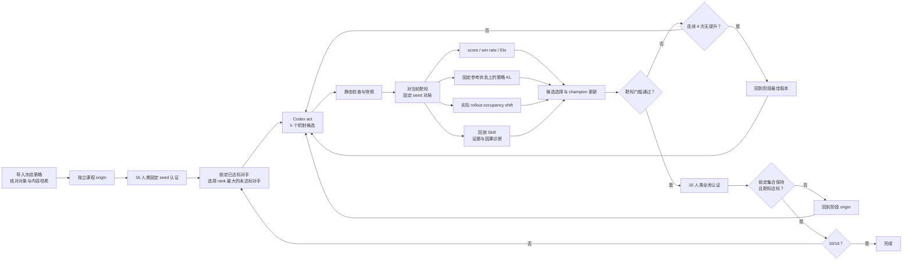

# 29_rollman HL 本地科研 Harness

## 1. 目标

科研 origin 由配置指定的冻结策略版本导入，并在新 run 中登记为 `v000000`。导入过程核对源对象清单与内容哈希；模型会话和 Experience Skill 从空状态开始，使课程实验从相同代码、相同上下文边界独立生长。

对 origin 执行 16 位人类 Ghost 的固定 seed 认证，将所有已达标对手加入锁定集合，并从未达标集合中选择数字 rank 最大的对手作为学习靶标。每个候选只对当轮靶标执行学习门槛赛；通过门槛后再进行全池认证。候选必须同时保持全部锁定对手且击破当轮靶标，才可进入下一课程阶段。停止条件为 16 位人类对手全部达到固定 seed 得分率 50%。

默认参数：

- `max_acts: null`：不设置人为迭代上限；
- `candidates_per_act: 1`：每轮产生一个候选；
- 课程回滚开启：全池认证丢失任一锁定对手时回到该阶段 origin；连续 4 个候选未提高靶标门槛分时停在该阶段最佳版本，恢复运行后从该最佳版本继续；
- Codex 上下文模式为 `resumable`；
- 确定性策略测量 `epsilon: 0.05`；
- 候选程序和人类程序在 default-deny 文件系统、无网络沙箱中执行，只读根目录和私有 scratch 显式声明；512 MiB 限额按完整后代进程树统计，进程组与脱离进程组的后代均清理；人类源码不进入 coding agent context。

`candidates_per_act`、rollback、epsilon、seed、认证门槛和其他消融对象均由 YAML 参数控制。

## 2. 迭代闭环



回滚只改变下一轮父版本。所有 act、候选、失败评测、代码对象和回放均保留。策略改进允许可解释的条件分支、有限状态机、搜索、规划和特征组合；prompt 禁止无因果依据的参数枚举、grid search、seed 记忆和固定回放坐标记忆，并要求从回放提出可证伪的机制修改。

## 3. Context 与 token

课程首个 Codex act 读取三个带哈希的静态文件：

- `rules.md`
- `decision_space.yaml`
- `rollman-replay/SKILL.md`

后续 act 使用 `codex exec resume` 续接已记录 thread，只发送增量 prompt：父版本、回放路径、测量结果、Experience Skill 路径和本轮约束。规则正文、决策空间和 SDK 不在每轮 prompt 中重复嵌入。

Coding agent 的允许读取集合由候选 workspace、本 run 的 context、Experience Skill、指定 replay/trace 和 measurement 组成。Prompt 禁止访问其他 run、其他候选、Framework 源码、人类程序、对手构建目录和用户目录中的其他文件；Provider 从原始 JSONL 审计每条命令中的访问路径。越界 act 记录为 provider failure，保存 token 和审计证据，但不执行比赛评测、不生成有效性能点、不更新 Experience、不参与版本晋级。

每局评测结束后，由 Harness 使用 Replay Skill 的冻结脚本生成紧凑 `summary.md`。Coding agent 必须从摘要中的完整性、分数和事件坐标开始，只对最多 2 个假设读取相关 trace 窗口；单条 trace 最多展开 20 个相关回合。每 act 的默认预算为 14 次工具调用、每条命令最多 6000 tokens 输出，禁止完整打印 replay、trace、棋盘或全量事件流。

Responses API 本身可按无状态接口理解：单次请求不自动等于可复现研究会话。Harness 将 Codex thread ID、精确 prompt、provider 配置指纹、原始 JSONL 和 token usage 写入 checkpoint，从而兼顾上下文复用与运行恢复。

无上限运行遇到 provider failure/timeout 或固定评测 incomplete 时立即停止，不自动重复失败请求；同一 run 可在外部条件恢复后继续。

本配置不使用 `codex exec --ephemeral`。`ephemeral` 表示不保留可恢复的本地会话状态，会破坏跨 act 的 resume。`disable_response_storage: true` 控制上游响应存储；本地科研产物仍按 run 目录保存。

模型调用消耗 `.env` 中 `AGENTBENCH_API_KEY` 对应账户的 token，不消耗 Codex App 对话预算。Harness 直接读取该键并构造仅供 Codex 子进程使用的环境，不把键加载进全局进程环境；API key 不进入构建程序、候选程序、人类程序、prompt、事件或报告。

## 4. 信息增益

Rollman 的人工审核决策空间是后端提交方向：

```text
0 STAY
1 UP
2 LEFT
3 DOWN
4 RIGHT
```

墙方向仍是协议合法动作，因此五个方向构成完整公共支持。Harness 不增加“目标道具”“路线”“战术”“对手类型”等假设动作。

候选程序通常输出一个确定方向。测量层使用：

```text
pi_epsilon(a|z) = (1-epsilon) I[a=f(z)] + epsilon/5
```

首个 origin 版本在固定 gate 对局中产生参考决策状态序列并冻结其哈希清单。这里冻结的是实际 rollout 中出现的原始状态，不是人工设计的战术类别；人工审核对象仅为完整原子动作空间。每个版本使用 SDK 的完整 `GameState`（包括 `space_info`）对同一参考序列重新执行策略，得到：

- `local_policy_kl_trace`：每个真实参考决策点的 `KL(new || parent)`；
- `episode_local_policy_kl`：每场对局的平均 KL 与轨迹 KL；
- `mean_local_policy_kl`：曲线汇总，单位为 nats/decision。

实际 rollout 的状态访问变化独立记录为 `occupancy_shift`。策略 KL 描述行为变化，不解释为认识论信息增益，也不使用反馈熵或人工战术假设空间。

内部记忆可通过候选返回的 `memory_id` 进入决策轨迹。固定参考探针按 episode 顺序调用策略，使状态机或有限记忆保持可观察和可审计。

## 5. 回放证据

回放 Skill 验证 JSONL，并区分：

- 关卡初始化帧；
- 普通结算帧；
- 终止 bookkeeping 帧。

缺失轮次不用于行为或因果推断；终止帧不视为决策点；碰撞结论必须同时核对同轮路径、技能状态和冻结事件。策略提案必须包含可见状态条件、可证伪假设和固定 seed 验证方案。无依据参数枚举、seed/坐标记忆和人类源码推断均被禁止。

## 6. 输出接口

每个 run 目录包含：

```text
events.jsonl
checkpoints/<act_id>.json
codex-home/config.toml
provider/<act_id>.jsonl
versions/manifests/
versions/objects/
matches/<version>/<phase>/<opponent>/<seed>/
  replay.jsonl
  trace.jsonl
  summary.md
measurement/reference/
measurement/probes/
experience/SKILL.md
experience/history/
report/curves.csv
report/matches.csv
report/curriculum.csv
report/curves.png
report/curves.svg
```

`curves.csv` 的稳定列包括：

- iteration、act、version；
- raw score、benchmark score、gain、best score；
- win rate；
- 按策略版本独立计算、角色固定且人类对手锚定的 Rollman Elo；认证赛逐局进入同一 Elo 事件流；
- mean local policy KL；
- occupancy shift；
- 当轮课程靶标、靶标门槛得分率；
- 全池得分率、已击破人类对手数；
- 课程事件标记；
- prompt、completion、total token 累计值。

图表接口为八面板：

1. score / gain / best score；
2. Rollman Elo；
3. 当轮靶标与全池得分率；
4. 已击破人类对手数；
5. 入选评测胜率；
6. 策略信息增益；
7. occupancy shift（状态访问分布差异）；
8. token 预算。

`curriculum.csv` 是课程生命周期的稳定接口，包含事件序号、coding-agent act、版本、当轮靶标、靶标门槛得分率、锁定对手数、已击破对手数和事件类型。

H2H-vs-origin 表示候选与初始版本直接对局的得分率。该指标可作为附加消融，不替代对冻结人类池的 benchmark score，也不是本配置的主停止条件。

## 7. 命令

安装：

```bash
python -m venv .venv
.venv/bin/python -m pip install -e '.[rollman,hl]'
cp .env.example .env
```

仅校验，不调用模型：

```bash
.venv/bin/agentbench hl validate --config configs/hl/29_rollman.yaml
.venv/bin/agentbench hl audit --config configs/hl/29_rollman.yaml
.venv/bin/agentbench hl run --dry-run --config configs/hl/29_rollman.yaml
.venv/bin/agentbench hl validate \
  --config configs/hl/29_rollman-curriculum.yaml
```

准备人类对手：

```bash
.venv/bin/agentbench hl prepare-opponents \
  --config configs/hl/29_rollman.yaml \
  --ranks 1
```

运行与恢复：

```bash
.venv/bin/agentbench hl run --config configs/hl/29_rollman.yaml
.venv/bin/agentbench hl run \
  --config configs/hl/29_rollman-curriculum.yaml \
  --run-dir .agentbench/29_rollman/runs/RUN_ID
.venv/bin/agentbench hl resume \
  --config configs/hl/29_rollman-curriculum.yaml \
  --run-dir .agentbench/29_rollman/runs/RUN_ID
```

生成曲线：

```bash
.venv/bin/agentbench hl report \
  --run-dir .agentbench/29_rollman/runs/RUN_ID
```

`--acts N` 用于 smoke test、调试和迭代轮数消融。创建课程 run 时，`--acts 0` 只导入 origin、执行全池认证和当轮靶标基线，不调用模型；resume 的 `--acts 0` 只重建持久状态，不调用模型；`--acts 1` 最多执行一次基于靶标回放的模型改进调用。正式目标运行省略该参数。

## 8. 冻结与裁判一致性

`validate`、`audit`、`run` 和 `resume` 均核对 `source_manifest.json` 中的 AgentBench、PacmanLogic、Logic core、PacmanSDK commit，以及冻结后端 `main.py` 和 core 文件哈希；任一不匹配即拒绝正式运行。

本地裁判执行后端下发的回合约束：首次 AI 响应 20 秒、后续响应 1 秒、AI 输出最多 1024 字节。游戏规则内的 TLE、RE、OLE 和 IA 由裁判回传冻结 Logic，按 Logic 的错误分数产生有效胜负；错误加减分只出现在 `end_info`，基础局面分保留在 replay。Logic、管线或外部执行基础设施无法完成时评测为 incomplete，不产生 aggregate score。

固定 seed 决定冻结环境的地图与环境随机流。若冻结人类程序自行从系统时间或操作系统熵初始化 RNG，其内部动作仍属于随机策略；Harness 不改写人类算法。此类对手的科研结果以原始 replay、对手制品哈希、seed 和重复对局协议复现，并通过增加重复对局数估计胜率，而不宣称逐字节轨迹确定性。

人类池构建只接受 `opponent_profiles.json` 登记且 SHA-256 完全匹配的 16 份冻结归档，不提供任意源码构建入口。构建阶段禁网、限制环境变量，并设置整棵进程树的时间、内存、进程数、输出量和构建目录占用上限；候选与人类程序的比赛运行阶段采用只读白名单、私有临时写目录、禁网、禁止派生进程和内存上限。

事件日志按事件类型校验必需字段、允许字段、类型、schema version 和 event ID 唯一性。代码版本对象以临时目录写入、fsync、原子重命名，并在读取和回滚前重新核对文件清单与内容哈希。`rollback_selected` 是持久 head 转移，因此中断恢复仍从选定历史 champion 继续。

每个满足 rank-1 门槛但尚未完成认证的入选版本都会接受认证，包括 gate 分数饱和时与 champion 同分的新版本。已完成但未达标的版本不重复认证；不完整认证允许重试。

## 9. 新游戏接入

统一后端目录、运行协议、日志、版本、回滚、Elo、曲线、provider 和 checkpoint 由 Framework 提供。游戏合作者只提交必须由人定义并人工审核的三类内容：

1. 游戏规则；
2. 完整决策空间；
3. 回放阅读 Skill。

后端注册表负责绑定冻结 Logic、SDK、角色、对手池、seed 和评测方式，不要求合作者重复上传统一基础设施参数。
