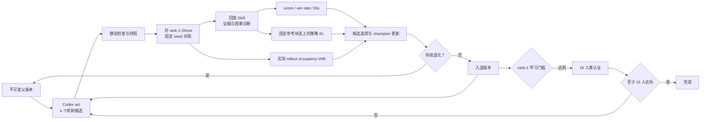

# 29_rollman HL 本地科研 Harness

## 1. 目标

Harness 驱动可解释 Rollman 程序从零开始迭代，学习对手固定为排名第一的 Ghost。候选达到学习门槛后，对 16 位人类 Ghost 执行冻结认证；至少 15 位对手上的固定 seed 得分率达到 50% 时满足停止条件。

默认参数：

- `max_acts: null`：不设置人为迭代上限；
- `candidates_per_act: 1`：每轮产生一个候选；
- 回滚开启：连续 3 个入选版本低于 champion 0.05 时，下一轮以 champion 为父版本；
- Codex 上下文模式为 `resumable`；
- 确定性策略测量 `epsilon: 0.05`；
- 人类程序只在隔离子进程中执行，不进入 coding agent context。

`candidates_per_act`、rollback、epsilon、seed、认证门槛和其他消融对象均由 YAML 参数控制。

## 2. 迭代闭环



回滚只改变下一轮父版本。所有 act、候选、失败评测、代码对象和回放均保留。

## 3. Context 与 token

首次 Codex act 读取三个带哈希的静态文件：

- `rules.md`
- `decision_space.yaml`
- `rollman-replay/SKILL.md`

后续 act 使用 `codex exec resume` 续接已记录 thread，只发送增量 prompt：父版本、回放路径、测量结果、Experience Skill 路径和本轮约束。规则正文、决策空间和 SDK 不在每轮 prompt 中重复嵌入。

Responses API 本身可按无状态接口理解：单次请求不自动等于可复现研究会话。Harness 将 Codex thread ID、精确 prompt、provider 配置指纹、原始 JSONL 和 token usage 写入 checkpoint，从而兼顾上下文复用与运行恢复。

本配置不使用 `codex exec --ephemeral`。`ephemeral` 表示不保留可恢复的本地会话状态，会破坏跨 act 的 resume。`disable_response_storage: true` 控制上游响应存储；本地科研产物仍按 run 目录保存。

模型调用消耗 `.env` 中 `AGENTBENCH_API_KEY` 对应账户的 token，不消耗 Codex App 对话预算。API key 只进入 Codex 子进程的 `CODEX_API_KEY`，不会进入候选程序、人类程序、prompt、事件或报告。

## 4. 信息增益

Rollman 的人工审核决策空间是后端提交方向：

```text
0 STAY
1 UP
2 LEFT
3 DOWN
4 RIGHT
```

墙方向仍是协议合法动作，因此五个方向构成完整公共支持。Harness 不增加“目标道具”“路线”“战术”“对手类型”等假设动作。

候选程序通常输出一个确定方向。测量层使用：

```text
pi_epsilon(a|z) = (1-epsilon) I[a=f(z)] + epsilon/5
```

首个 origin 版本在固定 gate 对局中产生参考决策状态序列。每个版本对同一参考序列重新执行策略，得到：

- `local_policy_kl_trace`：每个真实参考决策点的 `KL(new || parent)`；
- `episode_local_policy_kl`：每场对局的平均 KL 与轨迹 KL；
- `mean_local_policy_kl`：曲线汇总，单位为 nats/decision。

实际 rollout 的状态访问变化独立记录为 `occupancy_shift`。策略 KL 描述行为变化，不解释为认识论信息增益，也不使用反馈熵或人工战术假设空间。

内部记忆可通过候选返回的 `memory_id` 进入决策轨迹。固定参考探针按 episode 顺序调用策略，使状态机或有限记忆保持可观察和可审计。

## 5. 回放证据

回放 Skill 先验证 JSONL，再区分：

- 关卡初始化帧；
- 普通结算帧；
- 终止 bookkeeping 帧。

缺失轮次不用于行为或因果推断；终止帧不视为决策点；碰撞结论必须同时核对同轮路径、技能状态和冻结事件。策略提案必须包含可见状态条件、可证伪假设和固定 seed 验证方案。无依据参数枚举、seed/坐标记忆和人类源码推断均被禁止。

## 6. 输出接口

每个 run 目录包含：

```text
events.jsonl
checkpoints/<act_id>.json
codex-home/config.toml
provider/<act_id>.jsonl
versions/manifests/
versions/objects/
matches/<version>/<phase>/<opponent>/<seed>/
measurement/reference/
measurement/probes/
experience/SKILL.md
experience/history/
report/curves.csv
report/matches.csv
report/curves.png
report/curves.svg
```

`curves.csv` 的稳定列包括：

- iteration、act、version；
- raw score、benchmark score、gain、best score；
- win rate；
- role-scoped Rollman Elo；
- mean local policy KL；
- occupancy shift；
- prompt、completion、total token 累计值。

图表接口为六面板：

1. score / gain / best score；
2. Rollman Elo；
3. 冻结评测胜率；
4. 策略信息增益；
5. occupancy shift；
6. token 预算。

H2H-vs-origin 表示候选与初始版本直接对局的得分率。该指标可作为附加消融，不替代对冻结人类池的 benchmark score，也不是本配置的主停止条件。

## 7. 命令

安装：

```bash
python -m venv .venv
.venv/bin/python -m pip install -e '.[rollman,hl]'
cp .env.example .env
```

仅校验，不调用模型：

```bash
.venv/bin/agentbench hl validate --config configs/hl/29_rollman.yaml
.venv/bin/agentbench hl audit --config configs/hl/29_rollman.yaml
.venv/bin/agentbench hl run --dry-run --config configs/hl/29_rollman.yaml
```

准备人类对手：

```bash
.venv/bin/agentbench hl prepare-opponents \
  --config configs/hl/29_rollman.yaml \
  --ranks 1
```

运行与恢复：

```bash
.venv/bin/agentbench hl run --config configs/hl/29_rollman.yaml
.venv/bin/agentbench hl resume \
  --config configs/hl/29_rollman.yaml \
  --run-dir .agentbench/29_rollman/runs/RUN_ID
```

生成曲线：

```bash
.venv/bin/agentbench hl report \
  --run-dir .agentbench/29_rollman/runs/RUN_ID
```

`--acts N` 只用于 smoke test、调试和迭代轮数消融；正式目标运行省略该参数。

## 8. 新游戏接入

统一后端目录、运行协议、日志、版本、回滚、Elo、曲线、provider 和 checkpoint 由 Framework 提供。游戏合作者只提交必须由人定义并人工审核的三类内容：

1. 游戏规则；
2. 完整决策空间；
3. 回放阅读 Skill。

后端注册表负责绑定冻结 Logic、SDK、角色、对手池、seed 和评测方式，不要求合作者重复上传统一基础设施参数。

