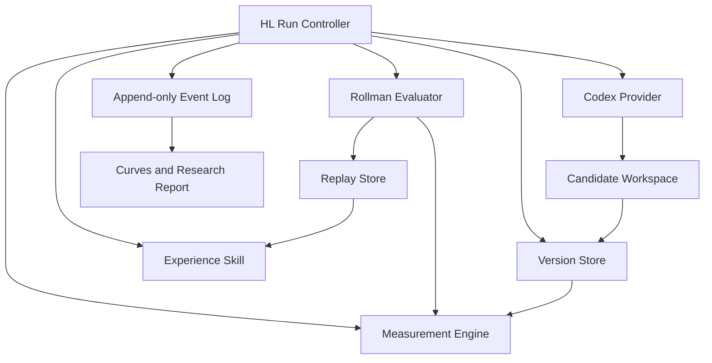

# AgentBench HL Rollman Harness 设计

## 1. 目标与边界

本设计在 `AgentBenchFramework` 内提供可复现的 Heuristic Learning（HL）闭环，并以 `29_rollman` 作为首个完整接入。

闭环包含：

1. coding agent 从零构建并持续改进 Rollman 选手程序；
2. 每个 `coding_agent_act` 产生一个不可变逻辑版本；
3. 每个版本使用冻结的学习对手、评测对手、地图 seed 和运行约束；
4. coding agent 通过比赛回放、上一轮测量与持久经验 Skill 学习；
5. 框架记录完整事件、模型用量、版本谱系、回滚、回放和评测；
6. 输出 benchmark score、胜率、Elo、局部策略 KL、occupancy shift 与预算曲线；
7. 支持 `k` 个并行候选、上下文策略、回滚策略、经验 Skill、评测强度等参数消融。

本地阶段不包含网站、服务器部署和正式长实验。模型 API key 只从运行时环境读取，不进入配置文件、日志、prompt、快照或 Git。

## 2. 核心科研对象

### 2.1 三类步数

- `coding_agent_act`：一次 coding-agent 调用，从任务输入到返回或失败。
- `game_agent_decision_step`：目标游戏 agent 在真实局面中作出一次动作。
- `env_step`：游戏后端执行双方动作并完成一次状态转移。

事件与曲线必须明确使用其中一种横轴，不允许混用。

### 2.2 性能

冻结评测集的主分数为：

```text
benchmark_score = (W + 0.5 * D) / (W + L + D)
```

`raw_score` 是初始版本分数，`evo_score_k` 是版本 `v_k` 的实际分数，`gain_k = evo_score_k - raw_score`。版本退化时仍保留实际值。`best_score_so_far` 是单独的辅助字段。

### 2.3 行为信息增益

Rollman 每次输出确定性方向，不要求模型或候选程序输出概率。对真实到达的目标 agent 决策上下文 `z=(s,m)`，使用完整合法动作集 `A(s)` 和统一测量随机化：

```text
pi_k^epsilon(a | z)
  = (1 - epsilon) * 1[a = f_k(z)] + epsilon / |A(s)|
```

局部策略信息增益为：

```text
KL(pi_k^epsilon(. | z) || pi_{k-1}^epsilon(. | z))
```

每个 episode 保存按决策顺序排列的 `local_policy_kl_trace`。该量描述策略行为变化，不解释为认识论信息增益。框架不创建战术假设空间、belief、posterior 或模型自报概率。

Rollman 的标准决策空间只包含该角色实际提交给后端的操作：

```text
rollman: {0: STAY, 1: UP, 2: LEFT, 3: DOWN, 4: RIGHT}
```

合法支持集由冻结后端语义定义。方向撞墙时仍是协议允许的动作，因此标准支持为五个方向。框架不从轨迹反推“目标物品”“战术意图”或高层动作。若候选程序显式实现统一高层决策 hook，相关分析作为独立扩展，不替代标准方向 KL。

### 2.4 Occupancy shift

对冻结评测条件中的真实到达状态生成规范化 state ID 直方图，计算版本间状态访问分布差异。它与局部策略 KL 分开保存和绘图，不相加。

## 3. Harness 架构



### 3.1 通用层

`agentbench_frame.hl` 提供：

- run config 与严格校验；
- provider 接口和 Codex CLI adapter；
- act 生命周期与 token/time 记录；
- content-addressed 版本快照；
- champion、parent、candidate、rollback 谱系；
- `k` 候选生成和选择；
- 冻结 benchmark 执行；
- append-only JSONL 事实日志；
- checkpoint、恢复与失败语义；
- Experience Skill 更新；
- 通用曲线数据接口。

### 3.2 游戏插件层

`agentbench_frame.games.rollman` 提供：

- 冻结后端定位和来源校验；
- Rollman/Ghosts stdio 协议；
- seed 注入；
- 候选与人类对手运行；
- replay 解析和自然语言摘要；
- 方向决策 hook 与合法支持；
- state ID；
- score/win/draw/loss 判定；
- Rollman 规则、决策空间、回放 Skill 和默认配置。

### 3.3 不透明人类对手

coding agent 只能读取自己的程序、规则、决策空间、回放指南、比赛回放、测量结果与经验 Skill。人类对手源码不挂载到候选 workspace，也不进入 prompt。Evaluator 在隔离路径中调用对手程序。

## 4. Token 高效且可复现的上下文

### 4.1 可恢复长会话

默认 `context_mode = "resumable"`：

1. 首个 act 启动 `codex exec --json`，保存 `thread_id` 和原始 JSONL；
2. 后续 act 使用该 thread 的 resume 模式，只发送本轮增量任务；
3. 大型静态材料保存在候选 workspace 外的只读 context bundle 中，由 prompt 引用具体路径；
4. 当前代码直接位于 workspace，不粘贴进 prompt；
5. 完整回放保存在 artifact 目录，prompt 只提供失败摘要和待分析回放索引；
6. Experience Skill 保存跨 act 的稳定经验、反例和未决问题。

会话只承担缓存与推理连续性，不作为事实源。每个 checkpoint 都保存足以在新 thread 中恢复的：

- 固定 context bundle 哈希；
- parent 版本；
- Experience Skill；
- 最近有效评测摘要；
- 选中的回放索引；
- 完整 prompt；
- provider 配置指纹；
- thread/session 元数据。

`context_mode = "fresh"` 作为消融项。恢复失败、上下文超限或显式 checkpoint 时，框架从上述文件创建新 thread，不重复内嵌全部长文。

### 4.2 Prompt 约束

每个候选必须：

1. 先引用至少一个具体回放现象或测量异常；
2. 写出可证伪的因果诊断；
3. 实现一个机制上连贯、可泛化的改进；
4. 运行静态检查和框架指定 smoke test；
5. 压缩或整合被替代的策略，避免无界堆叠；
6. 更新 Experience Skill 中的稳定经验与失败反例。

禁止把无依据阈值枚举、参数网格搜索或只改数字当作默认改进。数值修改只有在回放证据明确指向该边界时才允许。`k > 1` 时，各候选必须采用不同机制或诊断，不允许只使用不同阈值。

## 5. 版本、冠军与回滚

每个 act 即使没有代码 diff，也创建逻辑版本。每个版本记录：

- `version_id`、content hash、parent version；
- act、branch index 与 provider invocation；
- changed files；
- build/smoke/evaluation 状态；
- 实际 benchmark score、Elo、胜率和测量；
- 是否成为 champion；
- 是否作为回滚目标。

默认回滚策略：

```yaml
rollback:
  enabled: true
  policy: champion_on_sustained_degradation
  patience: 3
  score_margin: 0.05
```

当连续 `patience` 个完整评测版本都低于 champion 至少 `score_margin`，下一轮 parent 切换为历史 champion。所有退化版本、原始曲线和回滚事件完整保留。回滚只改变后续 parent，不删除、不覆盖、不重写事件。

`k=1` 是默认值。每个 act 从同一个 parent 产生 `k` 个候选，经相同 gate 选择一个 lineage head；未选候选也保存版本、回放、测量和预算。

## 6. 评测与停止条件

### 6.1 三层评测

- learning match：每个候选与 rank-1 Ghost 对手比赛并产生学习回放；
- fixed gate：每个候选在固定小型 seed 集上完成可比评测；
- certification：champion 候选在全部 16 位人类 Ghost 对手和冻结 seed 集上评测。

每个 coding-agent act 都产生 fixed-gate 曲线点。Certification 结果单独标识，不用缺失值或局部结果冒充完整评测。

### 6.2 Elo

每场有效比赛写入明确角色、对手、seed、结果。Elo 更新按逐场结果执行，不把一个 series 聚合成一次符号更新。Rollman 是非对称角色，曲线命名为 `rollman_elo`，人类对手在冻结池中作为锚点。无效运行、基础设施错误和未完成比赛不进入 Elo。

### 6.3 无硬迭代上限

默认：

```yaml
iteration:
  max_acts: null
  candidates_per_act: 1
```

长实验由成功标准停止，而不是固定轮数：

- champion 在 certification 中战胜至少配置数量的人类对手；
- 每个对手满足配置的胜率与重复对局要求；
- 结果来自冻结 seed、完整评测和有效比赛。

停滞触发回滚、经验压缩、诊断升级或 `k` 调整，不伪造成功，也不自动进行无依据 grid search。

## 7. Rollman 权威来源与冻结契约

来源优先级：

1. AgentBench 冻结后端；
2. 固定 commit 的 PacmanLogic 与 SDK 源码；
3. Rollman 正式游戏规则与通信文档；
4. 开发引导示例。

固定来源：

- AgentBench commit `b581bca3ba3d2d7d58a2f8c6bbddd060fc7fdc87`
- PacmanLogic commit `81d0468d177089cefe1f08ed1cffe78beb0d27e9`
- Logic-core commit `b293c04746fc3bf9b67a00130a2ca15fc38691bc`
- PacmanSDK-python commit `7bd36b9938570ad0cc0dcbd80d1a9d21efbfa539`
- GhostsSDK-python commit `da80f17c0341e4bfbe464e64f21a379c5c988961`

冻结后端 `core` 与 Logic-core 固定提交的对应文件哈希一致。机器可检验契约覆盖：

- 地图大小、最大轮数、关卡数；
- 五方向操作码；
- 地图元素枚举；
- 技能时长 `[8, 8, 8, 8, 2]`；
- 传送门开放轮次；
- 计分常量；
- 碰撞和结算顺序；
- replay 字段和事件枚举。

开发引导中的技能持续 10 轮、地图枚举编号等示例不覆盖冻结逻辑。

冻结后端读取 `random_seed` 但未初始化 Python `random`。Rollman adapter 在构造环境前显式设置 `random.seed(seed)` 与 `numpy.random.seed(seed)`，并把 seed 写入每场记录，保证地图可复现。

## 8. Rollman 人工输入接口

每个新游戏只要求合作者提供无法由通用后端推导的三类材料：

1. `rules.md`：人类可读规则与权威来源；
2. `decision_space.yaml`：标准化动作 ID、合法性、角色和决策 hook；
3. `replay-skill/`：回放字段解释、事件语义、诊断步骤和验证脚本。

游戏标识、run schema、版本存储、provider、事件日志、回滚、Elo、通用图表、预算、checkpoint 和默认 prompt 约束由 Framework 统一提供，不要求合作者重复填写。

## 9. 配置与消融

核心参数均可由 YAML/TOML 或 CLI 覆盖：

```yaml
provider:
  kind: codex
  model: gpt-5.5
  reasoning_effort: xhigh
  env_key: AGENTBENCH_API_KEY
  context_mode: resumable
iteration:
  max_acts: null
  candidates_per_act: 1
rollback:
  enabled: true
  patience: 3
  score_margin: 0.05
experience:
  enabled: true
  compress_every_acts: 5
measurement:
  epsilon: 0.05
  local_policy_kl: true
  occupancy_shift: true
evaluation:
  learning_opponent: rank01
  fixed_gate_seeds: []
  certification_opponents: all
```

可直接消融：

- `candidates_per_act = k`；
- `context_mode = resumable | fresh`；
- Experience Skill 开关；
- replay 指南开关；
- 回滚开关、patience、margin；
- 对手选择与 replay 数量；
- epsilon；
- 策略压缩周期；
- 推理强度和模型；
- gate 与 certification 调度。

## 10. 数据与图表接口

事实源为 finalized-only append-only `events.jsonl`。公共字段：

```text
schema_version, event_id, event_type, run_id, created_at
```

主要事件：

```text
run_started
act_completed
version_created
match_completed
evaluation_completed
policy_kl_measured
occupancy_measured
elo_updated
champion_promoted
rollback_selected
experience_updated
checkpoint_created
run_completed
```

外部失败产生状态事件和缺失指标，不记为 0。`summary.json`、CSV 和图表均从事实日志派生。

曲线接口输出：

- `curves.csv`：每行一个 act/version/evaluation；
- `matches.csv`：每行一场比赛；
- `local_policy_kl_trace.jsonl`；
- `occupancy.jsonl`；
- `curves.png`、`curves.svg`、可选 `curves.pdf`。

默认多面板：

1. `benchmark_score / gain / best_score_so_far`；
2. `rollman_elo`；
3. `win_rate`，含 rank-1 与 certification 分层；
4. `mean local policy KL` 与区间；
5. `occupancy shift`；
6. 累计 prompt/completion/total token 和 wall time。

原始 trace、逐局结果和预算保留，图表不是事实源。

## 11. 安全与可复现性

- `.env` 默认忽略；日志只记录 key 的环境变量名，不记录值；
- provider 子进程只获得白名单环境变量；
- 人类对手源码与 candidate workspace 隔离；
- context bundle、benchmark spec、opponent pool、seed set 和源码 commit 均哈希；
- 所有模型原始 JSONL 输出和 token usage 保存；
- checkpoint 可在新会话中恢复；
- run config、依赖版本、系统信息与 Git commit 写入 manifest；
- 未经完整 frozen evaluation 的结果不标记为 SOTA。

